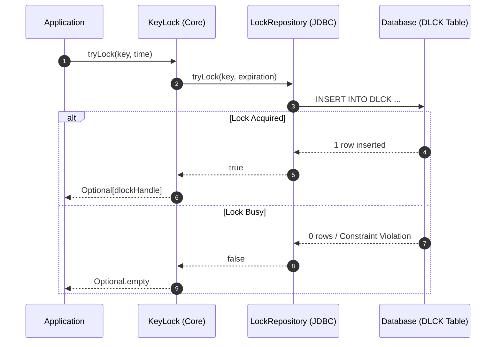
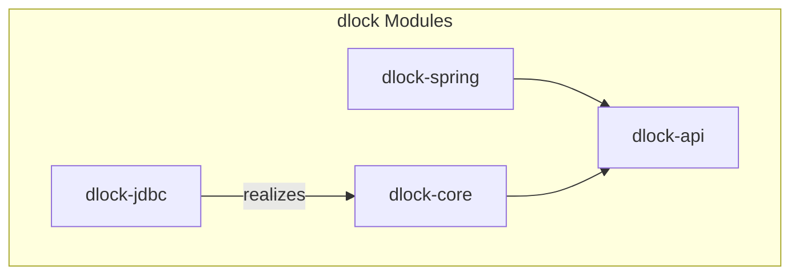

<h1 align="center">dlock</h1>
<p align="center">Distributed Lock Backed by Your Database</p>

[](https://github.com/pmalirz/dlock/actions/workflows/gradle.yml)
[](https://snyk.io/test/github/pmalirz/dlock)
[](https://codecov.io/gh/pmalirz/dlock)
[](LICENSE)
[](https://github.com/pmalirz/dlock/releases)
[](https://github.com/pmalirz/dlock/issues)
[](https://adoptium.net/)

**dlock** is a simple and reliable distributed locking solution for Java applications, using your existing database (JDBC) as the synchronization mechanism.

Why limit yourself to complex infrastructure like Redis or Zookeeper when your relational database can handle distributed locking with ACID guarantees?

## Key Features

* **Simplicity**: No extra infrastructure required. Uses standard JDBC.
* **Reliability**: Relies on database ACID transactions for strong consistency.
* **Declarative**: Use `@Lock` annotation with Spring.
* **Flexible**: Supports manual locking via `KeyLock` API.
* **Thread-safe**: A single `KeyLock` instance can be shared across multiple threads.

## Quick Start (Spring)

The most common way to use **dlock** is with Spring Framework support.

### 1. Add Dependencies

Add the following to your `build.gradle`:

```kotlin
// build.gradle.kts
implementation("io.github.pmalirz:dlock-spring:3.0.0")
implementation("io.github.pmalirz:dlock-jdbc:3.0.0")
```

Or `pom.xml`:

```xml
<dependency>
    <groupId>io.github.pmalirz</groupId>
    <artifactId>dlock-spring</artifactId>
    <version>3.0.0</version>
</dependency>
<dependency>
    <groupId>io.github.pmalirz</groupId>
    <artifactId>dlock-jdbc</artifactId>
    <version>3.0.0</version>
</dependency>
```

### 2. Configure Beans

Enable the aspect and configure the `KeyLock` bean.

```java
@Configuration
@ComponentScan("io.github.pmalirz.dlock") // Scan for LockAspect
public class DLockConfig {

    @Bean
    public KeyLock keyLock(DataSource dataSource) {
        return new JDBCKeyLockBuilder()
                .dataSource(dataSource)
                .databaseType(DatabaseType.H2) // or ORACLE, POSTGRESQL
                .createDatabase(true) // Automatically creates the DLCK table
                .build();
    }
}
```

### 3. Use @Lock Annotation

Annotate your methods with `@Lock`.

**Important**:

* If the lock cannot be acquired (e.g., held by another node), the method execution is **skipped**.
* If the method returns `Optional<T>`, `Optional.empty()` is returned. For other non-primitive return types, `null` is returned. For primitive return types (except `void`), a `LockException` is thrown.
* This pattern is best suited for scheduled tasks or void methods where "skip if running" is the desired behavior.
* If the method returns a value, the caller must handle `null` or exceptions in case of lock failure.

```java
@Service
public class InvoiceService {

    @Lock(key = "invoice-processing-{invoiceId}", expirationSeconds = 60)
    public void processInvoice(@LockKeyParam("invoiceId") Long invoiceId) {
        // Critical section: only one instance processes this invoice at a time.
        // If locked, this logic is skipped entirely.
        
        // ...
    }
}
```

## Programmatic Usage

You can also use the API directly without Spring.

### Using `KeyLock` Interface

```java
// 1. Initialize KeyLock (singleton)
KeyLock keyLock = new JDBCKeyLockBuilder()
        .dataSource(dataSource)
        .databaseType(DatabaseType.H2)
        .build();

// 2. Try to acquire a lock
Optional<LockHandle> lockHandle = keyLock.tryLock("my-resource-lock", 300); // 300 seconds expiration

if (lockHandle.isPresent()) {
    try {
        // Critical section
        performTask();
    } finally {
        // Always release the lock!
        keyLock.unlock(lockHandle.get());
    }
} else {
    // Lock is currently held by someone else
    log.info("Could not acquire lock, skipping task.");
}
```

### Auto-Release with Consumer or Function

For a simpler pattern where the lock is automatically released after the action completes:

```java
// With Consumer (void)
keyLock.tryLock("my-resource-lock", 300, handle -> {
    // This block is executed only if lock is acquired.
    performTask();
});

// With Function (returns value)
Optional<String> result = keyLock.tryLock("my-calc-lock", 300, handle -> {
    return computeResult();
});
```

## How It Works (JDBC)

**dlock** uses a dedicated table (default `DLCK`) to store active locks.

* **Acquire (`tryLock`)**: Attempts to `INSERT` a record with the lock key. If the key exists (unique constraint), the insert fails, meaning the lock is already held.
* **Release (`unlock`)**: Performs a `DELETE` on the record using the lock handle ID.
* **Expiration**: Locks have an expiration time. If a lock is not released (e.g., process crash), it can be reclaimed after expiration.

Example `DLCK` Table Schema (H2):

```sql
CREATE TABLE IF NOT EXISTS "DLCK" (
  "LCK_KEY" varchar(1000) PRIMARY KEY,
  "LCK_HNDL_ID" varchar(100) NOT NULL,
  "CREATED_TIME" DATETIME NOT NULL,
  "EXPIRE_SEC" int NOT NULL
);
CREATE UNIQUE INDEX IF NOT EXISTS "DLCK_HNDL_UX" ON "DLCK" ("LCK_HNDL_ID");
```

### Locking Sequence



> **Mutual exclusion is guaranteed** even under concurrent lock expiration reclaim across multiple nodes. See [dlock-jdbc Safety Guarantees](./dlock-jdbc/README.md#safety-guarantees) for the full analysis.

## API Guidelines

When using the `KeyLock` API, keep the following constraints in mind:

* **`lockKey`** must be a non-blank string, up to 1000 characters (the database column limit).
* **`expirationSeconds`** must be greater than 0.
* **Lock keys should be descriptive and scoped** (e.g., `"/invoice/{id}"`) to avoid unintended collisions.

## Project Structure

* [**dlock-api**](./dlock-api): Core interfaces (`KeyLock`, `LockHandle`).
* [**dlock-core**](./dlock-core): Base implementation logic (expiration policies, utilities).
* [**dlock-jdbc**](./dlock-jdbc): JDBC implementation (H2, Oracle, PostgreSQL support).
* [**dlock-spring**](./dlock-spring): Spring integration (`@Lock` aspect).



## Local Development

Prerequisites: JDK 17+

Build the project:

```bash
./gradlew build
```

Run benchmarks:

```bash
./gradlew :dlock-core:jmh
./gradlew :dlock-jdbc:jmh
```

## Benchmarks

The following benchmarks demonstrate the throughput of **dlock-core** (in-memory) and **dlock-jdbc** (H2 database) implementations.

### Test Environment

* **CPU**: AMD Ryzen 9 5900X (12 cores / 24 threads, max 3.7 GHz)
* **RAM**: 64 GB DDR4 3600 MHz
* **OS**: Windows 11 Pro
* **Database**: H2 (TCP mode) for JDBC tests
* **Threads**: 12 (matching number of physical cores)

### Results (Throughput in ops/s)

| Module | Benchmark Scenario | Description | Score (ops/s) | Error (ops/s) |
| :--- | :--- | :--- | :--- | :--- |
| **dlock-core** | `tryAndReleaseLockNoCollision` | Acquire & release unique key (random UUID); no collision | **895.5 k** | ± 523.8 k |
| | `tryLockAlwaysCollision` | Attempt to acquire an active lock; 100% collision | **48.9 M** | ± 2.8 M |
| | `tryLockExpiresEverySecond` | High-frequency attempts on single key (1s expiration) | **45.2 M** | ± 10.4 M |
| **dlock-jdbc** | `tryAndReleaseLockNoCollision` | Acquire & release unique key (random UUID); no collision; DB pre-populated with 100k locks | **11.1 k** | ± 0.2 k |
| | `tryLockAlwaysCollision` | Attempt to acquire an active lock; 100% collision | **47.6 k** | ± 5.4 k |
| | `tryLockNoCollision` | Acquire unique key (random UUID) without release | **18.3 k** | ± 17.2 k |

> **Note**: `dlock-core` is purely in-memory and serves as a baseline for overhead. `dlock-jdbc` involves actual network/database round-trips to the H2 server (local, file-based server, not in-memory).
>
> The `tryAndReleaseLockNoCollision` JDBC benchmark pre-populates the database with 100k existing locks before measurement to simulate a realistic "noisy" table and measure performance under non-trivial data volume.

## License

This project is licensed under the Apache License 2.0. See [LICENSE](LICENSE) for details.
