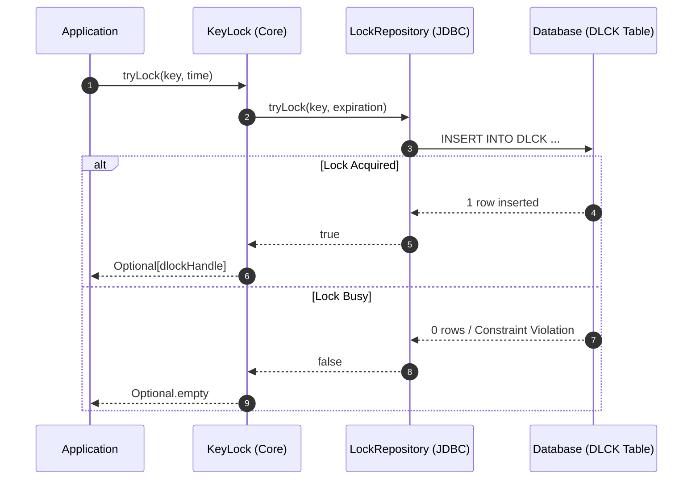
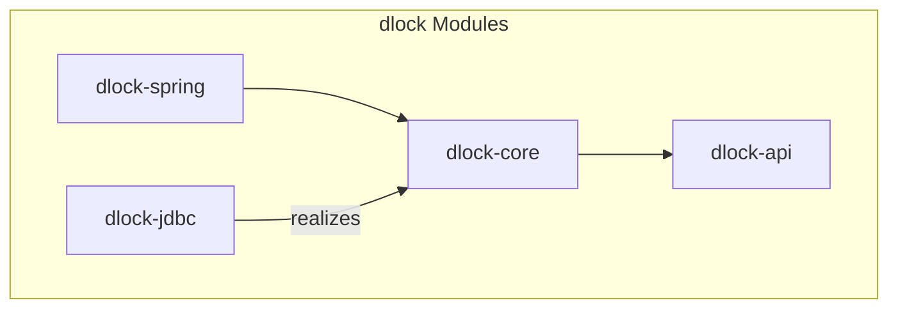

# dlock - Distributed Lock Backed by Your Database

[](https://github.com/pmalirz/dlock/actions/workflows/gradle.yml)
[](https://snyk.io/test/github/pmalirz/dlock)
[](https://codecov.io/gh/pmalirz/dlock)

**dlock** is a simple and reliable distributed locking solution for Java/Kotlin applications, using your existing database (JDBC) as the synchronization mechanism.

Why limit yourself to complex infrastructure like Redis or Zookeeper when your relational database can handle distributed locking with ACID guarantees?

## Key Features

* **Simplicity**: No extra infrastructure required. Uses standard JDBC.
* **Reliability**: Relies on database ACID transactions for strong consistency.
* **Declarative**: Use `@Lock` annotation with Spring.
* **Flexible**: Supports manual locking via `KeyLock` API.
* **Thread-safe**: A single `KeyLock` instance can be shared across multiple threads.

## Quick Start (Spring)

The most common way to use **dlock** is with Spring Framework support.

### 1. Add Dependencies

Add the following to your `build.gradle`:

```kotlin
implementation("com.dlock:dlock-spring:3.0.0-SNAPSHOT")
implementation("com.dlock:dlock-jdbc:3.0.0-SNAPSHOT")
```

Or `pom.xml`:

```xml
<dependency>
    <groupId>com.dlock</groupId>
    <artifactId>dlock-spring</artifactId>
    <version>3.0.0-SNAPSHOT</version>
</dependency>
<dependency>
    <groupId>com.dlock</groupId>
    <artifactId>dlock-jdbc</artifactId>
    <version>3.0.0-SNAPSHOT</version>
</dependency>
```

### 2. Configure Beans

Enable the aspect and configure the required beans: `KeyLock` and `ClosableKeyLockProvider`.

```java
@Configuration
@ComponentScan("com.dlock") // Scan for LockAspect
public class DLockConfig {

    @Bean
    public KeyLock keyLock(DataSource dataSource) {
        return new JDBCKeyLockBuilder()
                .dataSource(dataSource)
                .databaseType(DatabaseType.H2) // or ORACLE
                .createDatabase(true) // Automatically creates the DLCK table
                .build();
    }

    @Bean
    public ClosableKeyLockProvider closableKeyLockProvider(KeyLock keyLock) {
        return new ClosableKeyLockProvider(keyLock);
    }
}
```

### 3. Use @Lock Annotation

Annotate your methods with `@Lock`.

**Important**:

* If the lock cannot be acquired (e.g., held by another node), the method execution is **skipped**.
* This pattern is best suited for scheduled tasks or void methods where "skip if running" is the desired behavior.
* The annotation currently does not support returning values (swallows return values).

```java
@Service
public class InvoiceService {

    @Lock(key = "invoice-processing-{invoiceId}", expirationSeconds = 60)
    public void processInvoice(@LockKeyParam("invoiceId") Long invoiceId) {
        // Critical section: only one instance processes this invoice at a time.
        // If locked, this logic is skipped entirely.
        
        // ...
    }
}
```

## Programmatic Usage (Java/Kotlin)

You can also use the API directly without Spring.

### Using `KeyLock` Interface

```java
// 1. Initialize KeyLock (singleton)
KeyLock keyLock = new JDBCKeyLockBuilder()
        .dataSource(dataSource)
        .databaseType(DatabaseType.H2)
        .build();

// 2. Try to acquire a lock
Optional<LockHandle> lockHandle = keyLock.tryLock("my-resource-lock", 300); // 300 seconds expiration

if (lockHandle.isPresent()) {
    try {
        // Critical section
        performTask();
    } finally {
        // Always release the lock!
        keyLock.unlock(lockHandle.get());
    }
} else {
    // Lock is currently held by someone else
    log.info("Could not acquire lock, skipping task.");
}
```

### Using Closable Provider (Table-Flip safe)

```java
ClosableKeyLockProvider provider = new ClosableKeyLockProvider(keyLock);

provider.withLock("my-resource-lock", 300, handle -> {
    // This block is executed only if lock is acquired.
    // Lock is automatically released after this block.
    performTask();
});
```

## How It Works (JDBC)

**dlock** uses a dedicated table (default `DLCK`) to store active locks.

* **Acquire (`tryLock`)**: Attempts to `INSERT` a record with the lock key. If the key exists (unique constraint), the insert fails, meaning the lock is already held.
* **Release (`unlock`)**: Performs a `DELETE` on the record using the lock handle ID.
* **Expiration**: Locks have an expiration time. If a lock is not released (e.g., process crash), it can be reclaimed after expiration.

Example `DLCK` Table Schema (H2):

```sql
CREATE TABLE IF NOT EXISTS "DLCK" (
  "LCK_KEY" varchar(1000) PRIMARY KEY,
  "LCK_HNDL_ID" varchar(100) NOT NULL,
  "CREATED_TIME" DATETIME NOT NULL,
  "EXPIRE_SEC" int NOT NULL
);
CREATE UNIQUE INDEX "DLCK_HNDL_UX" ON "DLCK" ("LCK_HNDL_ID");
```

### Locking Sequence



> **Mutual exclusion is guaranteed** even under concurrent lock expiration reclaim across multiple nodes. See [dlock-jdbc Safety Guarantees](./dlock-jdbc/README.md#safety-guarantees) for the full analysis.

## API Guidelines

When using the `KeyLock` API, keep the following constraints in mind:

* **`lockKey`** must be a non-blank string, up to 1000 characters (the database column limit).
* **`expirationSeconds`** must be greater than 0.
* **Lock keys should be descriptive and scoped** (e.g., `"/invoice/{id}"`) to avoid unintended collisions.

## Project Structure

* [**dlock-api**](./dlock-api): Core interfaces (`KeyLock`, `LockHandle`).
* [**dlock-core**](./dlock-core): Base implementation logic (expiration policies, utilities).
* [**dlock-jdbc**](./dlock-jdbc): JDBC implementation (H2, Oracle support).
* [**dlock-spring**](./dlock-spring): Spring integration (`@Lock` aspect).



## Local Development

Prerequisites: JDK 17+

Build the project:

```bash
./gradlew build
```

Run benchmarks:

```bash
./gradlew :dlock-jdbc:jmh
```

## License

This project is licensed under the Apache License 2.0. See [LICENSE](LICENSE) for details.
